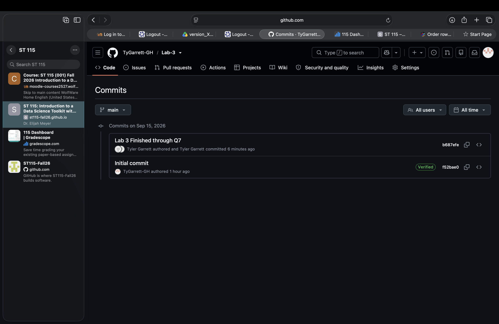

## Question-1

Already up to date. This makes sense as no significant changes or code has been written yet. 

## Question 2
Install packages should be in your console because putting it in the console allows it to go to your library.

## Question 3
Library should be in your .qmd file so we can access it whenever.

## Question 4
This shouldn't work becuause the palmer penguins data set hasn't been installed yet. 
## Question 5
```{r}
library(palmerpenguins)

penguins

# No, we do not need the library function to print the palmer penguin data set.
```
## Question 6
```{r}
library(dplyr)
```

```{r}
suppressWarnings(library(dplyr))
# We can remove warning through the suppress warnings command or the echo false command. 
```

## Question 7
```{r}
iris2 <- arrange(iris, Petal.Length)
head(iris2)
```

## Question 8

